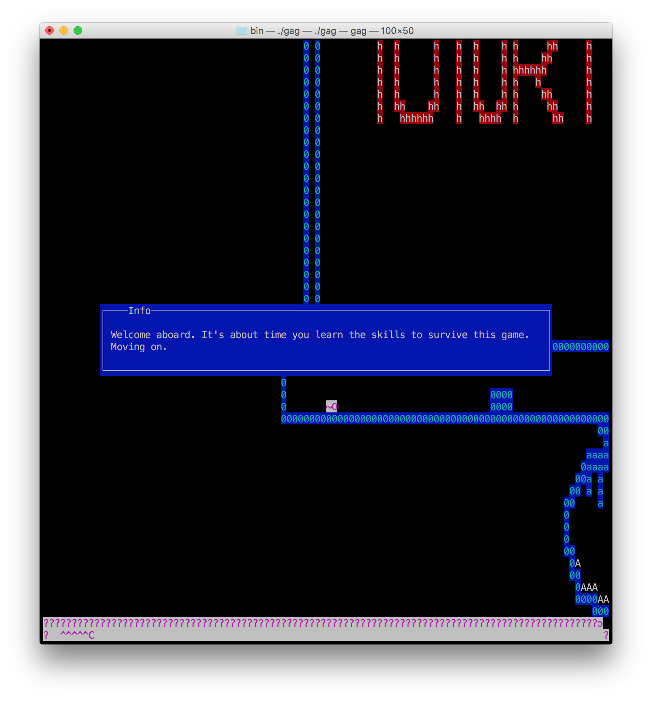
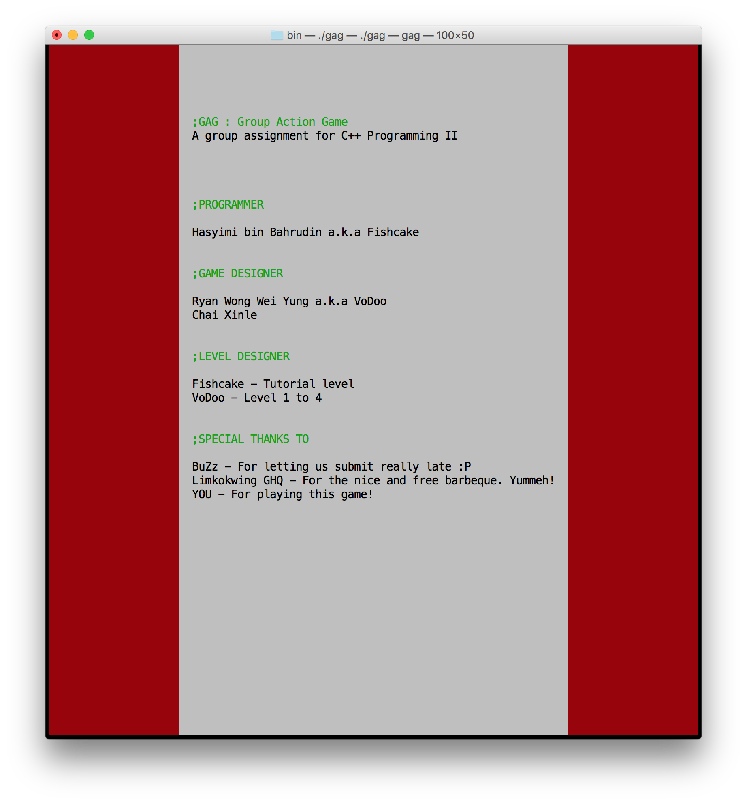

## Introduction

GAG (Group Action Game) is a game I programmed in 2009 for the final assignment of C++ programming class on my 2nd semester. It is an ASCII platformer game where the user performs action (e.g. jump, attack, etc.) by typing words.

## Credits

- Ryan Wong: for designing the levels
- Xinle Chai: for the moral support :P
- BuZz: for letting us submit late :P

## Dependencies

- curses ([PDCurses](http://pdcurses.sourceforge.net/) for Windows)

## Compiling

```
% make
```

## Playing

Due to a bug, you need to `cd` into the `bin` directory and run the game from there in order to access the default levels:

```
% cd bin
% ./gag
```

## Screenshot



